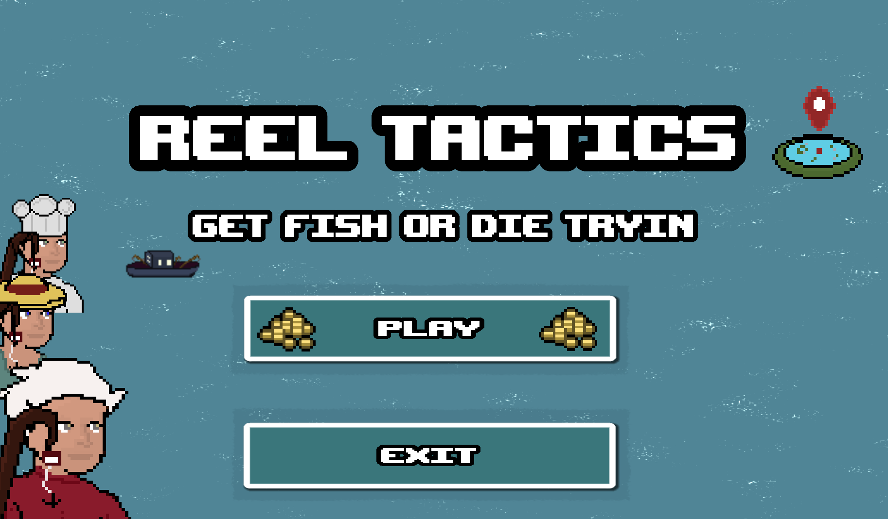

# REELTACTICS-game-jam-
A turn based strategy game with minigames competing against AI enemies.

## Overview

Welcome to the **Godot Fishing Game**! This project is a turn-based strategy game where the player competes against NPCs to catch fish, sell them, and accumulate the most wealth. The game includes features such as dynamic NPC behavior, special events, and a feedback loop where player actions influence NPC actions.

## Features

- **Turn-Based Strategy**: Compete against NPCs in a strategic fishing competition.
- **Dynamic NPC Behavior**: NPCs adapt based on the player's performance, creating a challenging and engaging experience.
- **Special Events**: Random events and challenges that add variety and excitement to the game. (in progress)
- **Detailed Fishing Mechanics**: Different fish species with varying rarities and values.
- **Smooth Movement and Collision Handling**: Player and NPC characters move and interact within a physics-based environment.
- **Hand-Made Pixel Art**: Created all art assets in Aseprite.

## Play the Game

You can try the game directly on itch.io:

[Play Reel Tactics: Get Rich or Die Tryin' on itch.io](https://okumu.itch.io/reel-tactics-get-rich-or-die-tryin)

- Created as a 2 person team project with a mdominik.